# Artifacts on Meta AI

*AI for utility: Shaping artifact sharing and the considerations that follow*

## Overview

**Description:** Sparking fresh engagement with new formats of AI-generated content.

**Context:** Our research scientists had come up with the ability for us to introduce artifacts into Meta AI. Artifacts can come in different formats (txt files, HTML files, JSON files, etc.). Users were able to create report cards, seating charts, games, and spreadsheets with artifacts.

- **Role:** Lead product designer
- **Team:** Me, 1 Product manager, 7 Engineers, 2 ML Engineers
- **Tools:** Figma
- **Timeline:** 2 months

## Case study

As part of the muse spark launch we had the bare bones of artifact sharing but there were improvements to be done on both receiver and sender side.

### Sender

HMW improve the artifact experience to get users to share?

Originally there were 3 different ways to view an artifact,

**Gallery:**

- **Expand in new window** ([Video: Expand in new window](../videos/es-expand-new-window.mov))
- **Interact inline** ([Video: Interact inline](../videos/es-interact-inline.mov))
- **Open in new window** ([Video: Open in new window](../videos/es-open-new-window.mov))

I streamlined them so that users could either open in a new window or open on a sidebar while editing.

[Video: Open in a new window](../videos/es-open-to-interact.mov)

*Open in a new window*

[Video: Open on a sidebar](../videos/es-expand-sidebar.mov)

*Open on a sidebar*

Some bottom rail actions were redundant and there was no clear hierarchy applied to them, to clean up the chat, I place the actions within the title bar.

**Gallery:**

- **Original bottom rail of actions** (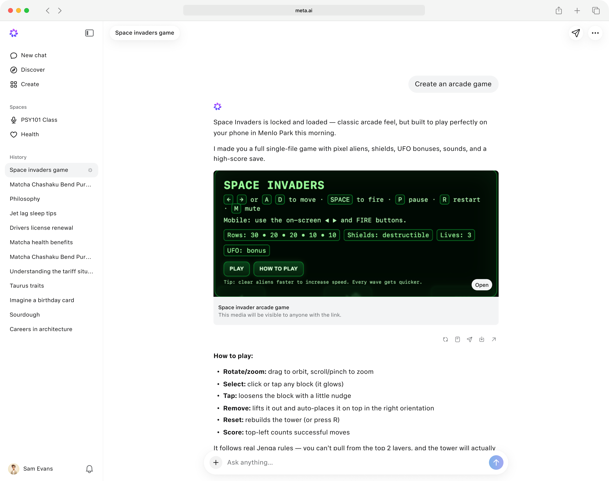)
- **Actions on hover were not as obvious** (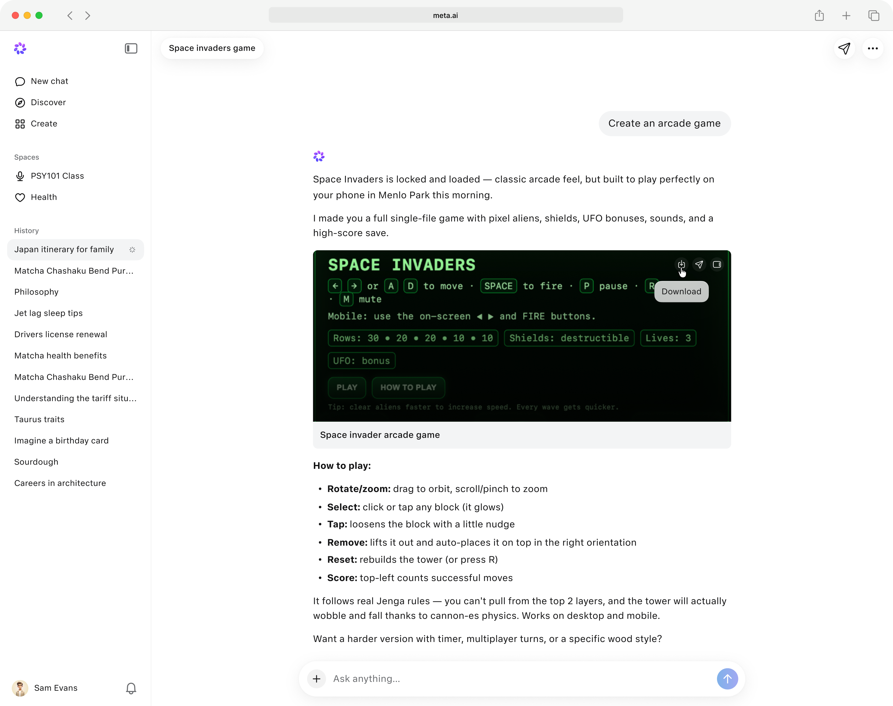)
- **Within title** (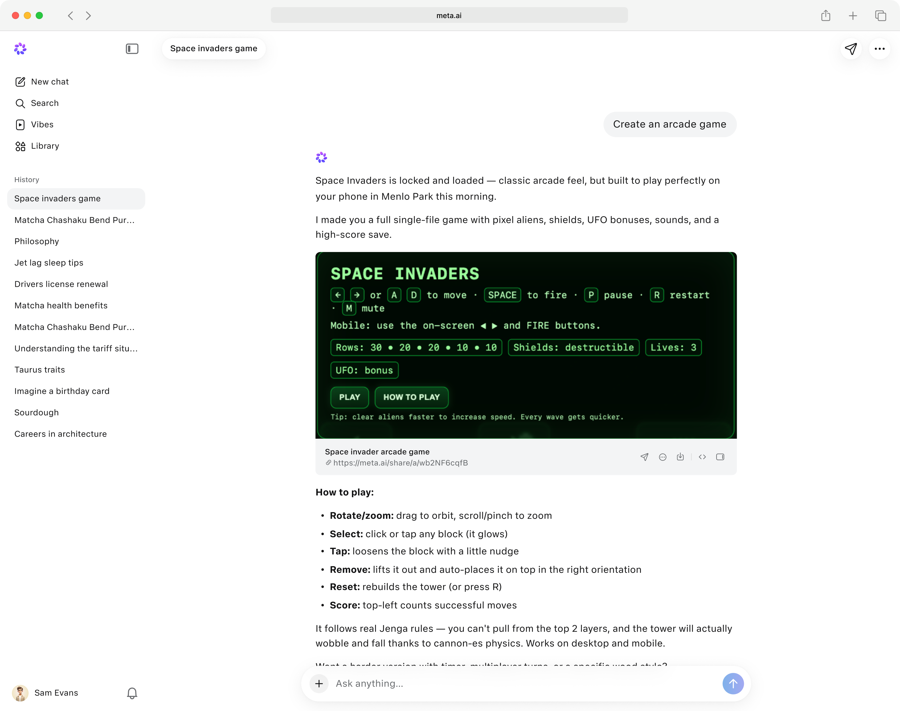)

### Receiver

HMW encourage users to create their own artifacts?

In parallel, we planned to build a library for artifacts. For any artifact shared we wanted receivers to have the ability to create their own and creators to get validation from their creations. We approached this problem in 2 ways: the ability for receivers to create their own similar artifact and applying creator attribution when artifact is opened

The original artifact on open already had multiple elements in the navigation bar. This was due to having legal requirements to show and requirements to allow user to navigate back to the home page. To make space for even more elements such as creator attribution and "Create your own".  We cleaned up the header to account for all elements.

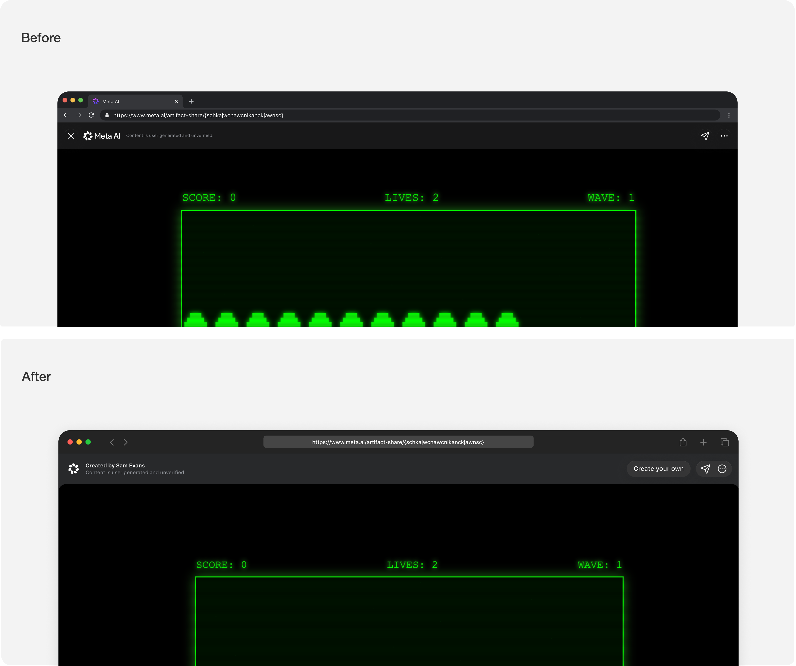

*Cleaning up header for artifact open*

Instead of share attribution, we decided to change it to creator attribution to create a sense of ownership on the artifact. This would eventually help create clout from artifact creators and inspire others to create. The rotating carousel animation was too subtle and we needed a more obvious way to incorporate attribution while defining that it was being opened on the receiver end.

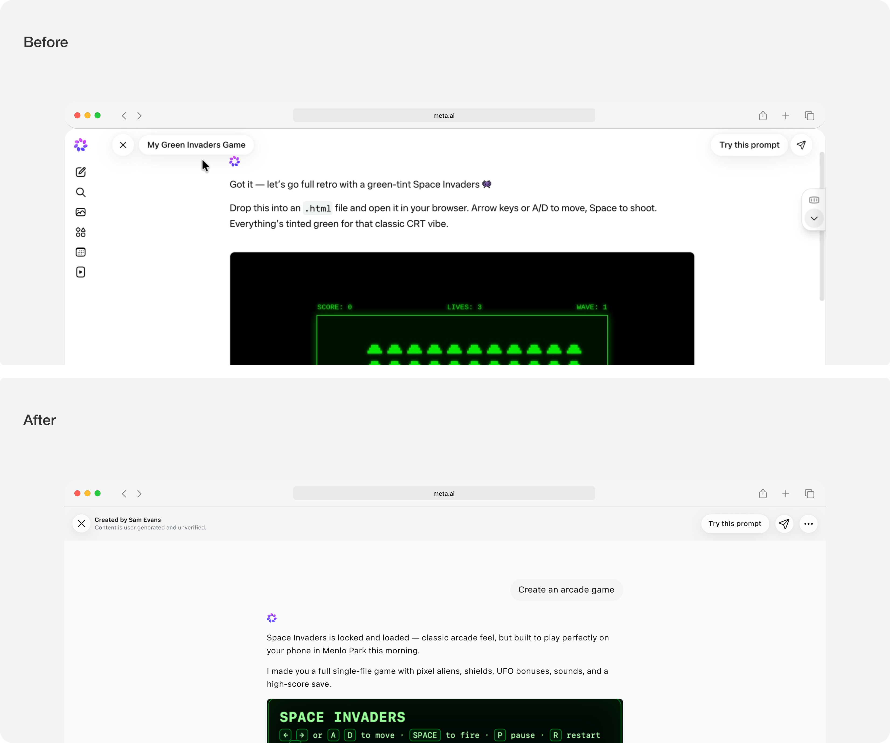

*Unifying header for chat open*

Defining this header allowed us to scale the share infrastructure of Meta AI - regardless of chat or artifact being shared, the header would be consistent on the receiver's end. This made it easier to scale across all platforms. Additionally, it allowed us to feed the inventory for artifact library.

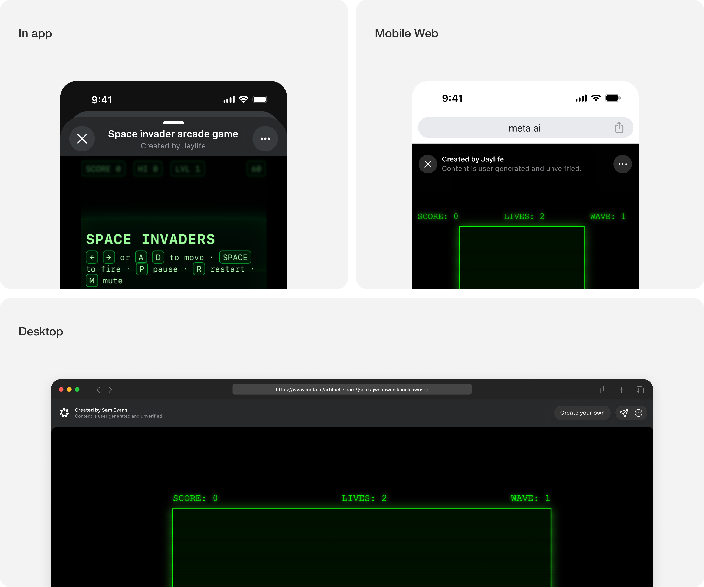

*Artifact open on all platforms*

Additionally, it allowed us to feed the inventory for artifact library.

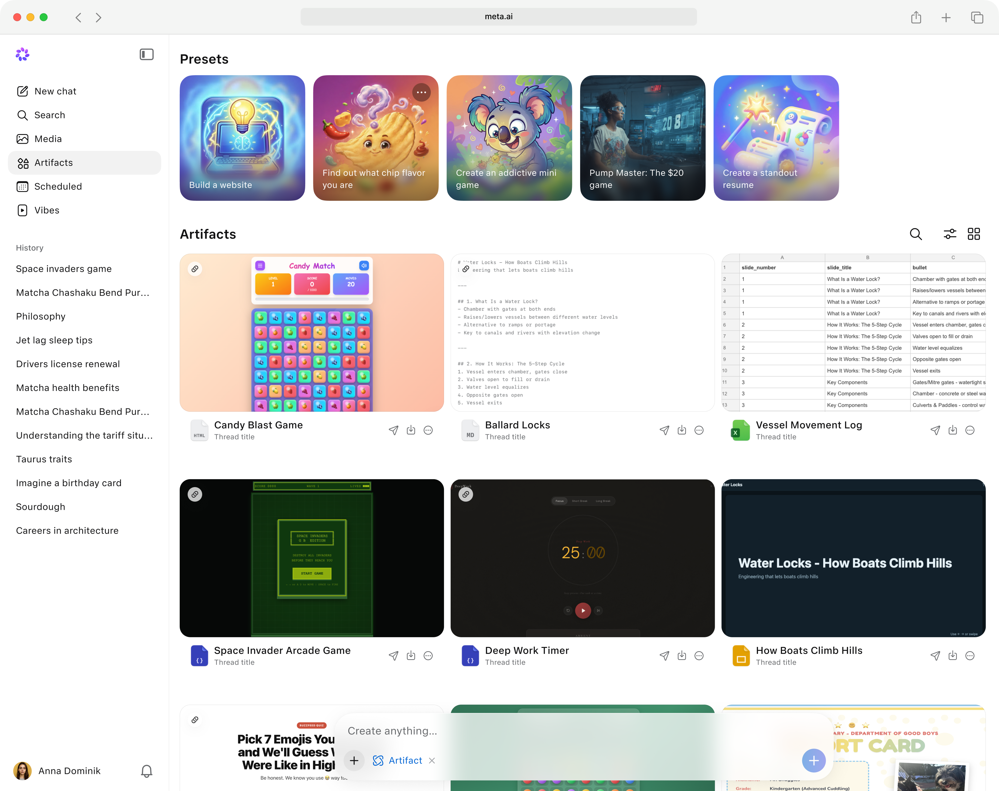

*Artifact library*

Upon creating artifact sharing workflows, I noticed a miscommunication within the sharing experience: When there have been changes made in the chat, and the user decides to share the 2nd time. The link is updated in the back end. As a result, whoever had the original link would be able to see updated changes.

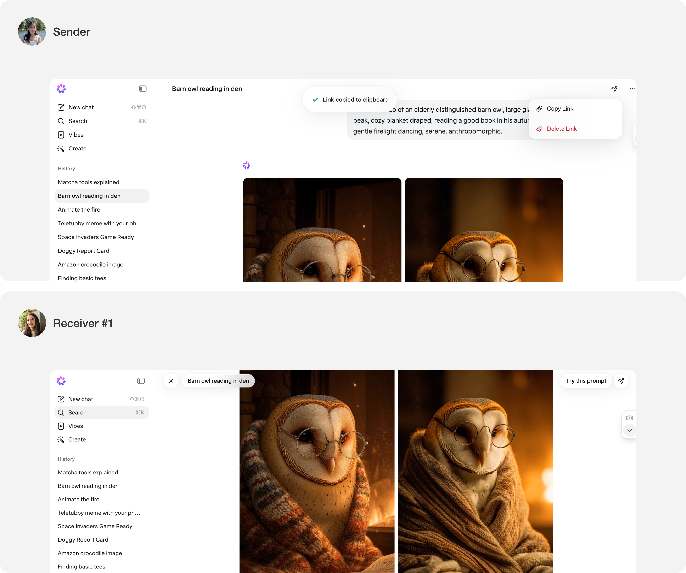

*On first share*

[Video: Sharing after making changes to a chat. Original receiver will see updates when revisiting the link](../videos/es-sharing-after-changes.mov)

*Sharing after making changes to a chat. Original receiver will see updates when revisiting the link*

We looked into 2 paradigms:

First, we looked into the google drive paradigm. Once a share link is created and a receiver has access to that link they will be forever able to have access to that link unless revoked. However, given Meta AI is a nascent product, not everyone had a Meta AI account. Users without Meta AI accounts would not be able to access the link, preventing reach.

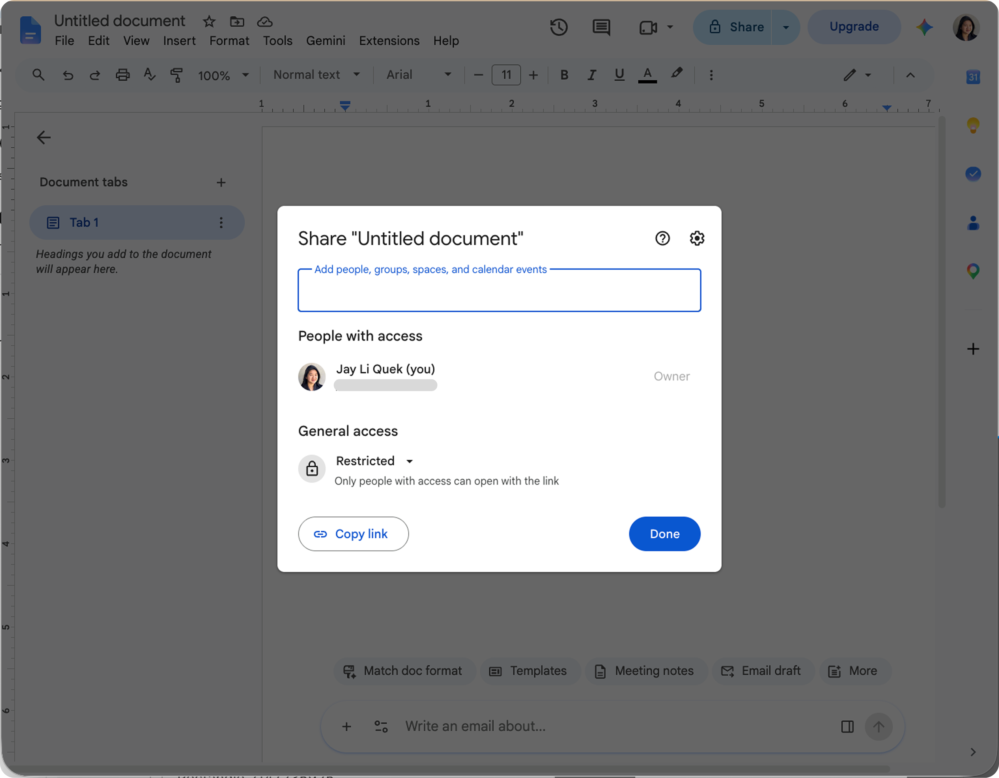

*Google drive paradigm*

We've also seen some users use an individual MetaAI chat to feed all information. This posed a risk to sharing paradigms and resulted in us thinking about how explicitly we should default allow all changes to be shown without warning.

We looked into 4 gradual ways from subtle to blocking to inform users any updates in the chat will be surface to original receivers.

**Options, from subtle to blocking:**

- Option #1: Disclaimer within composer (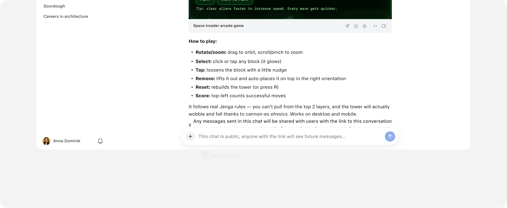)
- Option #2: Upon typing, disclaimer above composer will show (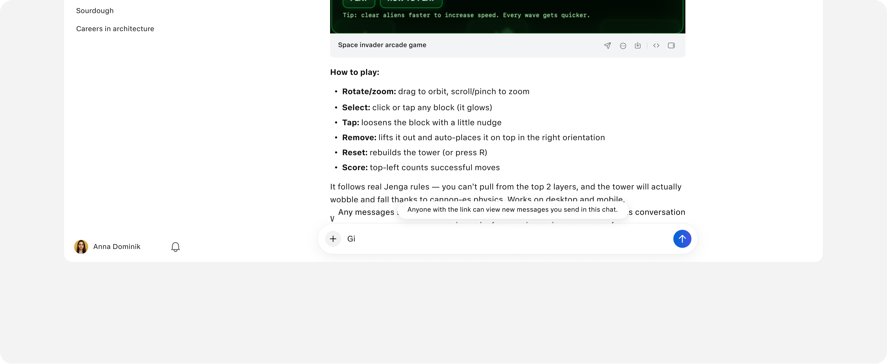)
- Option #3: Disclaimer after message send (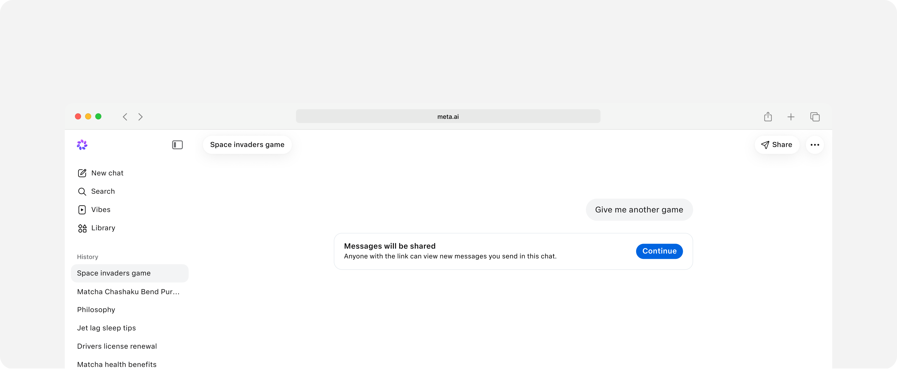)
- Option #4: Modal after message send (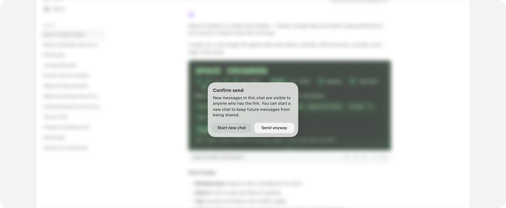)

Despite having these patterns, there were concerns from the product team that despite education users may not be aware of these changes and we should err on the side of safety. This led to our 2nd paradigm

2\. Disclaimer on share: Senders would have to proactively update the link

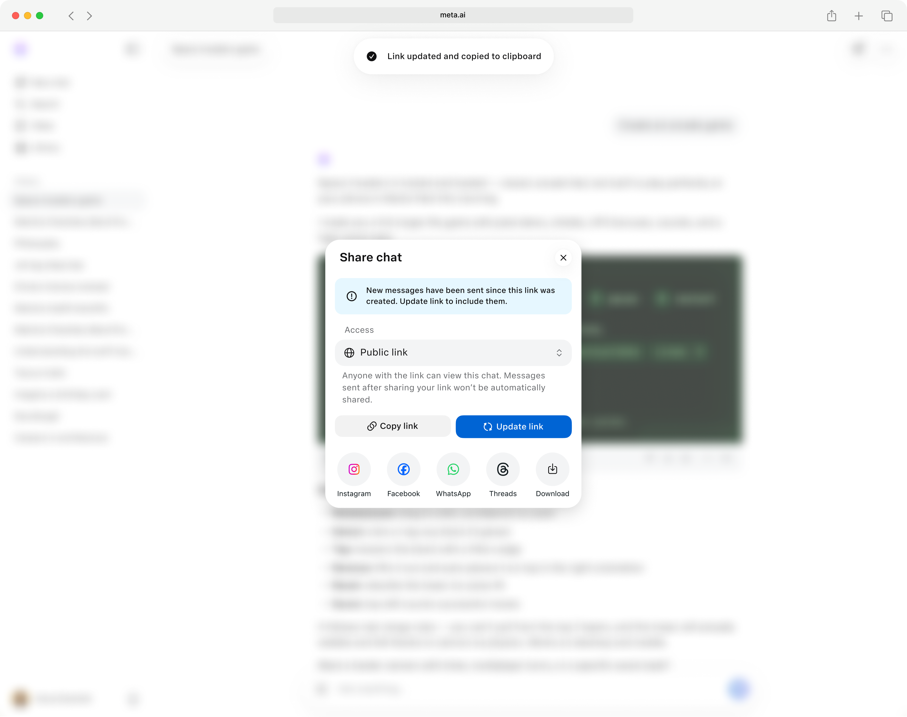

*Disclaimer with update CTA with new updates in chat*

As design lead for sharing on Meta AI, I scaled the sharing infrastructure on Meta AI and fixed unintended bugs to make the unglamorous parts of sharing seamless. The new receiver experience is now consistent across shared chats and artifacts, creating a cohesive system, which has built the blueprint for other features to come.

Shipped in May 2026 on [meta.ai](https://meta.ai/)
