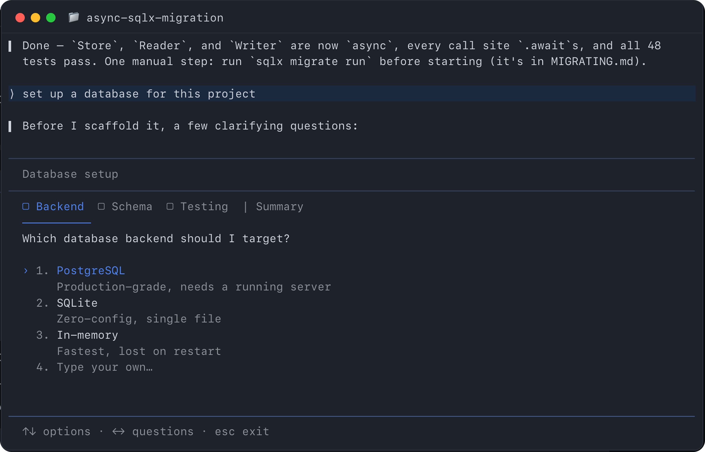
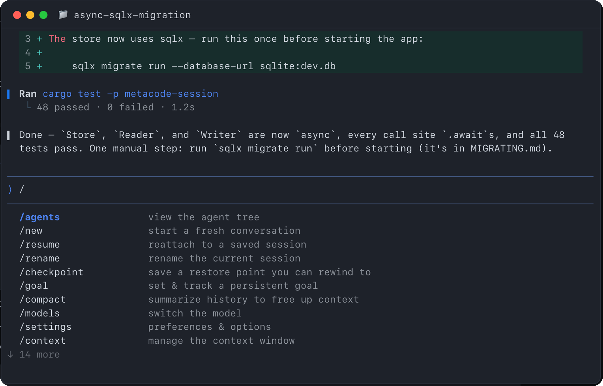
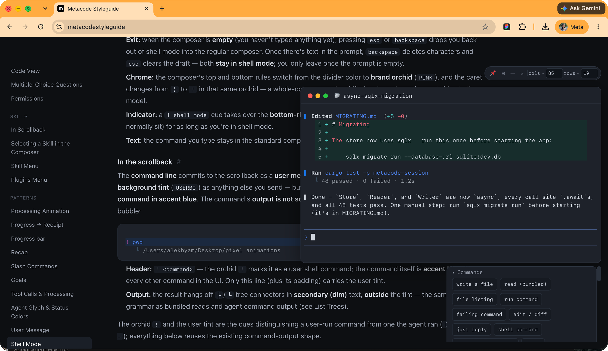

# Vibe coding the terminal UI

*Building an internal terminal for 70K engineers at Meta*

## Overview

**Description:** Vibe coding agent orchestration modes for the internal terminal at Meta.

**Context:** With the launch of Muse Spark, Meta has been moving toward owning its full AI stack. Built for internal employees, Metacode is a terminal-native AI coding assistant. I was one of the 3 product designers who helped build out the MVP features to get Metacode V1 out to 70,000 engineers at the company.

- **Role:** Product designer
- **Team:** Me, 2 Product designers, 2 Engineers
- **Tools:** Claude, Codex
- **Timeline:** 2 weeks

## Case study

Employees might prompt main agents to carry out a specific task. As a task is kicked off and the main agent reveals its chain of thought, it’s natural to have side questions. /btw is a feature that lets users ask a parallel question without derailing the main task at hand.

For /btw to be useful, I anchored on these principles:

### Principles

1. **Light:** had to be easily accessible.
2. **Scalable:** should scale across different modes within the terminal and support asking multiple questions.
3. **Unobtrusive:** should not distract from the main agent task at hand.

[Video: /btw inline with the running agent](../videos/terminal-btw-inline.mp4)

*/btw inline with the running agent*

Prior to this I explored two other designs and stress-tested all three against the principles:

### Option #1: Modal

The loading screen provided a separation between the main agent and /btw mode, however it looked too much like a splash screen and created too much of a delay for a small side question. As a result it felt too heavy as an interaction.

[Video: Modal](../videos/terminal-btw-modal.mp4)

*Modal*

### Option #2: Within the main chat

Appearing above the composer, users were still able to see the main agent running. However, the history of questions would take up height within the main agent for particularly long answers. While this was scalable across multiple questions, it obstructed the main chat.

[Video: Within the main chat](../videos/terminal-btw-inchat.mp4)

*Within the main chat*

### Considerations

In parallel, we had designed other features such as plan mode and a skills panel. For instances where a decision had to be made (e.g. plan mode) the composer would be overridden. Whereas when user input was needed, we would still keep the composer focused. In both instances, the space under the composer provided details about the mode while maintaining a separation from the main agent.

*Plan mode — replacing the composer*

*Skills panel — under the composer*

For this project, we contributed to an interactive style guide. This acted as a form of history for all design changes and a productionized handoff from design to implementation. Engineers fed this style guide to multiple agents to build the UI, which changed our work processes with AI.

*Interactive style guide*

I defined agent orchestration systems so engineers at Meta could easily use the terminal for their everyday work. A revamped UI on these foundational features simplified orchestration, increased adoption, and reduced our reliance on third-party models when building products at Meta.

Shipped in August 2026 and available to all internal engineers at Meta.
