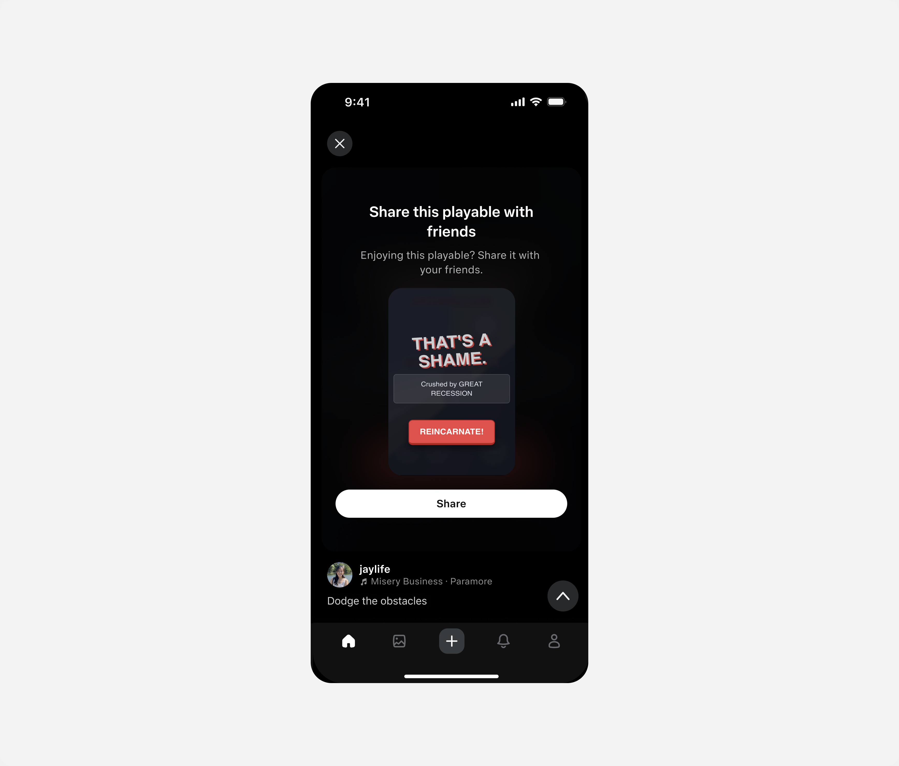
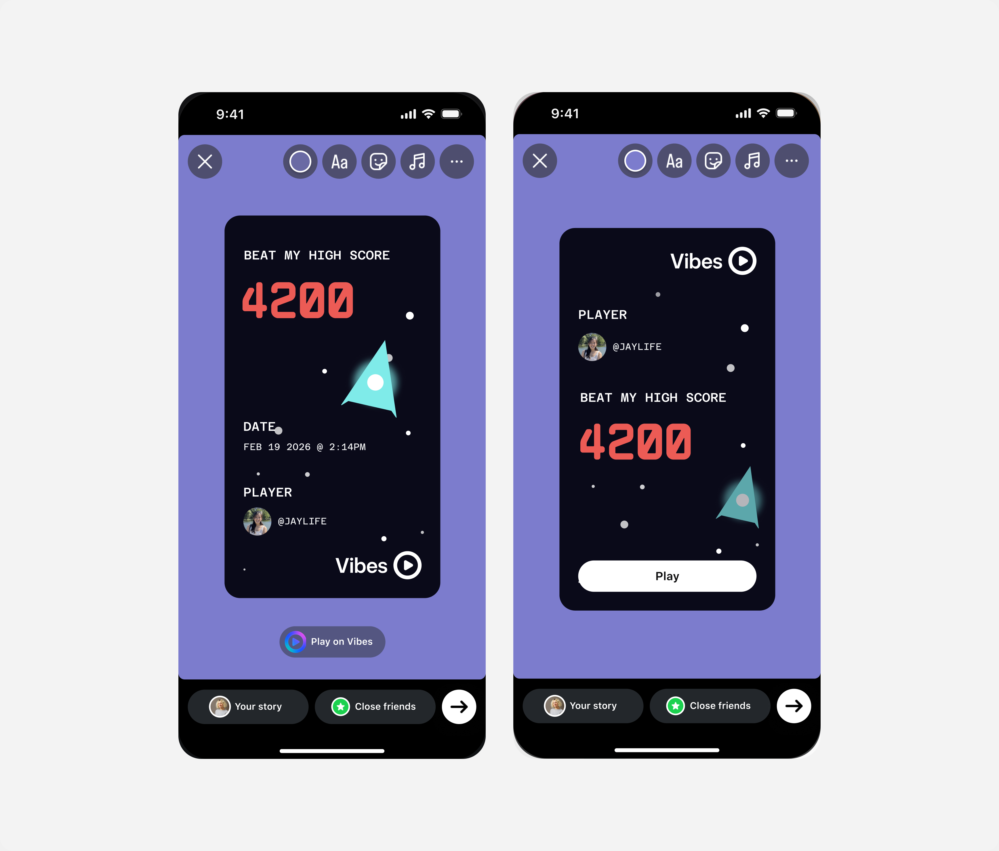
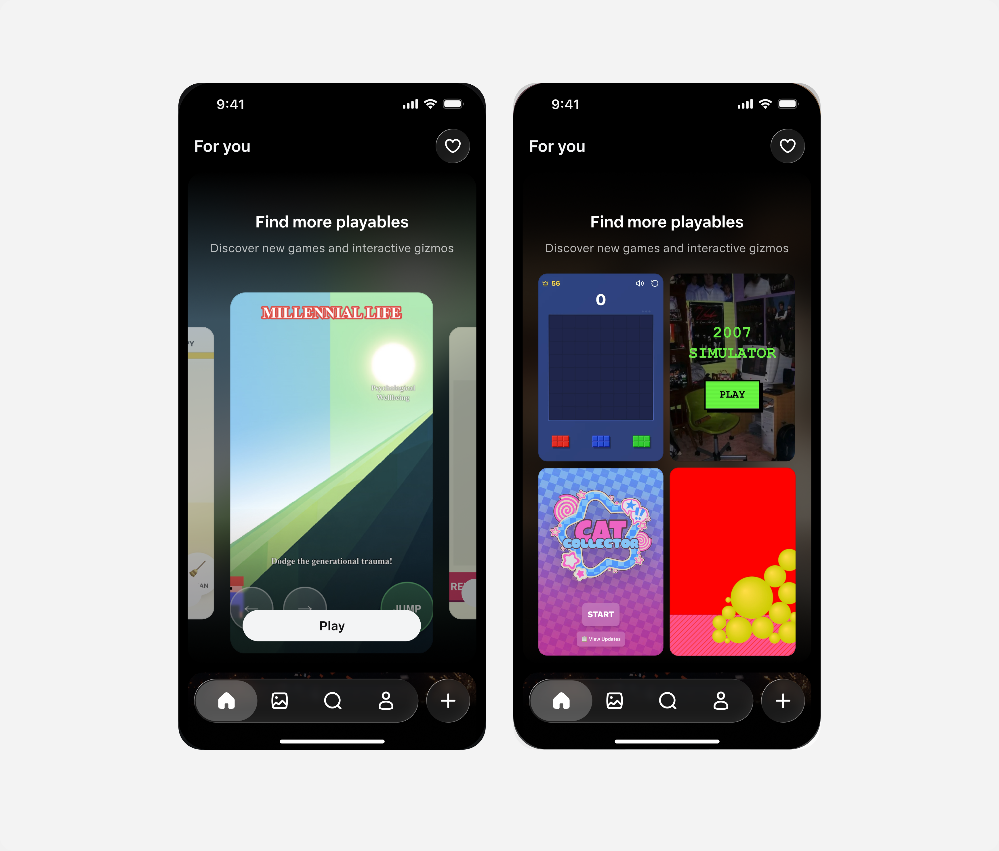
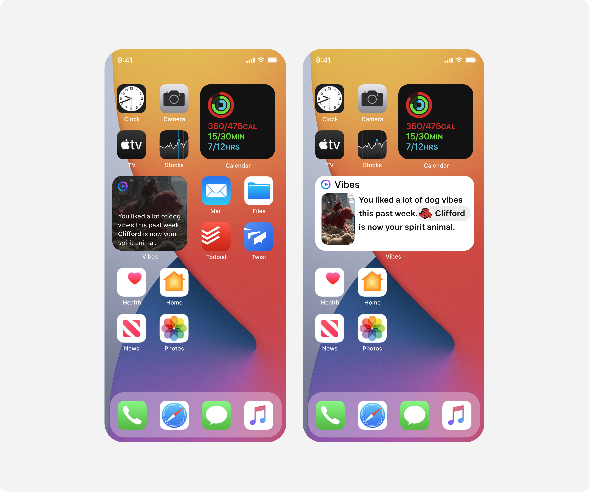

# Kickstarting the growth flywheel on Vibes

*Building the sharing & growth infrastructure for a suite of new features*

## Overview

**Description:** Sparking fresh engagement with new formats of AI-generated content.

**Context:** Vibes is a standalone app for AI-powered entertainment media that lets users create, remix, and share AI-generated media for social use cases. It launched in Mexico, Brazil, and three regions such as Latin America, the Caribbean, and Southeast Asia & the Pacific Islands.

- **Role:** Lead product designer
- **Team:** Me, 2 Product managers, 4 Engineers, 1 Content engineer
- **Tools:** Cursor, Figma, Claude
- **Timeline:** 3 weeks

## Case study

After releasing our minimum viable product, we were planning on releasing a new suite of AI-generated formats. This consisted of playables — an interactive AI-generated format that could be a game, an art piece, or a music generator — and vibe check — AI-generated videos released weekly and curated specifically for users based on their own data across Meta.

[Video: Playables and vibe check](../videos/vibes-playables.mov)

*Playables and vibe check*

With these new features I ideated on how we could foster conversation from both playables and vibe check, and the ability for users to express themselves through AI-generated content.

### Playables

We started off with staple patterns from our general playbook such as midcards, end cards, and high-score cards. However, they were met with a slew of constraints.

**Gallery:**

- **End card** — It was a privacy violation to extract that metadata. ()
- **High-score cards** — Skewed too closely to games as a value prop, even though playables came in different formats. ()
- **Midcard** — Did not have enough inventory for our surfaces. ()

I advocated for a screenshot capability, which enabled us to use pre-existing operating-system patterns to allow a shareable format to stories. On screenshot the share sheet would pop up and users could post the moment they wanted to share. This manifested in another feature capability to spur conversation within the comments section.

[Video: Screenshot detection and screenshot entry point in the comment section](../videos/vibes-screenshot.mov)

*Screenshot detection and screenshot entry point in the comment section*

### Vibe check

For vibe check, the main value prop came from the AI-generated video as well as the quip. We wanted to make sure both were being showcased, and encouraged users to view their own vibe check.

We looked into different animations and patterns.

**Explorations:**

#### Full-canvas quip

[Video: Full-canvas quip](../videos/vibes-option1-full-canvas.mov)

Pros:

- Utilizes the full canvas of the story

Cons:

- Not scalable — text could possibly cover other vibes

#### Contained card

[Video: Contained card](../videos/vibes-option2-card.mov)

Pros:

- Showcases both the video and the quip clearly
- Legible and scalable on any background

Cons:

- Less immersive than the full canvas
- Smaller video preview

#### Share card

[Video: Share card](../videos/vibes-option3-sharecard.mov)

Pros:

- Anchored on the quip first and showed a summary of vibe check
- Showcased all features

Cons:

- Expensive to build on engineering

In addition, we looked at expanding entry points such as showing vibe check outside the app.

*Widgets*

As lead product designer, I advocated for a better product experience despite a timeline push-back. As a result, we multiplied the share rate by 2× with a new screenshot capability. Considering both sharers and receivers, all landing experiences were accounted for to ensure new and existing users were able to try playables and vibe check on a nascent product.
